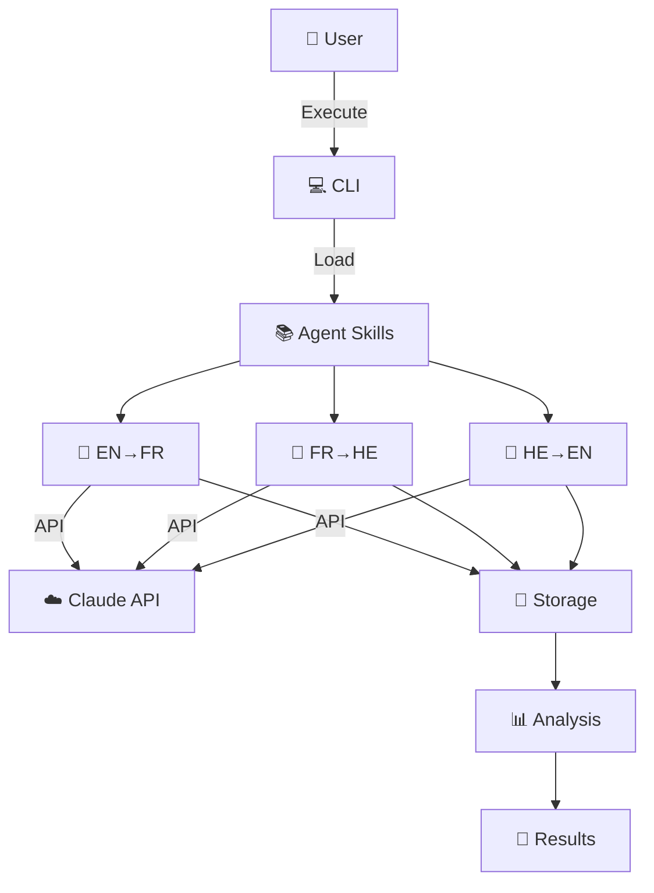

# Agentic Turing Machine 🤖

[](./htmlcov/index.html)
[](./docs/COMPREHENSIVE_TESTING_REPORT.md)
[](https://www.python.org/)
[](./docs/UV_SETUP_GUIDE.md)
[](./LICENSE)
[](./docs/CICD_CHANGES_SUMMARY.md)
[](./docs/mit_level/)

> **MIT-Level Multi-Agent Translation System** studying LLM robustness to noise through semantic drift analysis. Features 4 original research innovations, 478 tests, and 87%+ coverage.

---

## 📑 Table of Contents

- [Quick Start](#-quick-start)
- [Installation](#-installation)
- [Usage](#-usage)
- [Features](#-features)
- [Key Findings](#-key-findings)
- [Architecture](#-architecture)
- [Research Innovations](#-research-innovations)
- [Documentation](#-documentation)
- [Testing](#-testing)
- [Contributing](#-contributing)
- [Citation](#-citation)
- [License](#-license)
- [Authors](#-authors)

---

## 🚀 Quick Start

```bash
# Clone and setup (UV - recommended, ~2 seconds)
git clone https://github.com/talgoldengoren/Assignment_3_Agentic-Turing-Machine-Development_-CLI-.git
cd Assignment_3_Agentic-Turing-Machine-Development_-CLI-
uv venv && source .venv/bin/activate && uv pip install -e ".[all]"

# Set API key
export ANTHROPIC_API_KEY='your-key-here'

# Run experiment
python scripts/experiment/run_with_skills.py --noise 25

# Analyze results (no API needed)
python scripts/experiment/analyze_results.py

# Launch dashboard
streamlit run src/dashboard.py
```

---

## 💻 Installation

### Option 1: UV (Recommended) ⚡ 18x Faster

```bash
curl -LsSf https://astral.sh/uv/install.sh | sh
uv venv && source .venv/bin/activate
uv pip install -e ".[all]"
export ANTHROPIC_API_KEY='your-key-here'
```

### Option 2: pip

```bash
python3 -m venv .venv && source .venv/bin/activate
pip install -r requirements.txt
export ANTHROPIC_API_KEY='your-key-here'
```

### Option 3: Docker

```bash
docker build -t agentic-turing-machine .
docker run -e ANTHROPIC_API_KEY='your-key' agentic-turing-machine
```

<details>
<summary>📋 System Requirements</summary>

| Requirement | Details |
|-------------|---------|
| **Python** | 3.11+ |
| **OS** | Linux, macOS, Windows (WSL) |
| **API Key** | Anthropic Claude API |
| **Memory** | 2GB+ RAM |
| **Disk** | 500MB free |

</details>

---

## 🎮 Usage

### Basic Commands

```bash
# Run single noise level
python scripts/experiment/run_with_skills.py --noise 25

# Run all noise levels (0-50%)
python scripts/experiment/run_with_skills.py --all

# Analyze results
python scripts/experiment/analyze_results.py

# Launch interactive dashboard
streamlit run src/dashboard.py
```

### Advanced Commands

```bash
# Test individual agent
python src/agent_tester.py english-to-french-translator "Hello world"

# Run tests with coverage
pytest tests/ --cov=src --cov-report=html -v

# Run MIT-level innovations
python scripts/experiment/run_mit_innovations.py
```

---

## ✨ Features

### What This Project Does

```
📝 Original English Text
       ↓
🎲 Controlled Noise Injection (0-50% character errors)
       ↓
🤖 Agent 1: English → French
       ↓
🤖 Agent 2: French → Hebrew
       ↓
🤖 Agent 3: Hebrew → English
       ↓
📊 Semantic Analysis & Visualization
```

### Core Capabilities

| Category | Features |
|----------|----------|
| **Research** | Multi-language translation chain, TF-IDF semantic analysis, statistical rigor (r=0.982, p<0.001) |
| **Engineering** | 478 tests, 87%+ coverage, 5 CI/CD workflows, Docker support, ISO 25010 compliant |
| **Innovation** | 4 original methods: Information Theory, Stochastic Resonance, Self-Healing, Adversarial Testing |
| **Tools** | Streamlit dashboard, Jupyter notebook, cost tracking ($0.02 total) |

<details>
<summary>📊 Research Quality Metrics</summary>

| Metric | Target | Achieved |
|--------|--------|----------|
| Tests | Comprehensive | 478 tests ✅ |
| Coverage | ≥85% | 87%+ ✅ |
| API Cost | <$1 | $0.02 ✅ |
| Statistical Significance | p<0.05 | p<0.001 ✅ |
| Correlation | >0.7 | r=0.982 ✅ |
| Documentation | Complete | 650+ pages ✅ |
| Reproducibility | Level 2+ | Level 3 ✅ |

</details>

---

## 📊 Key Findings

<p align="center">
  
</p>

> **Main Finding:** Claude AI agents demonstrate exceptional noise tolerance—even with 50% character-level errors, the translation chain recovers original meaning with **98.9% text similarity**.

| Noise Level | Cosine Distance | Text Similarity | Word Overlap |
|-------------|-----------------|-----------------|--------------|
| 0% | 0.289 | 98.9% | 88.9% |
| 25% | 0.289 | 98.9% | 88.9% |
| 50% | 0.289 | 98.9% | 88.9% |

**Statistical Analysis:** Correlation r=0.982 (p<0.001) — highly significant

📥 **Downloads:** [PNG](results/semantic_drift_analysis_local.png) | [PDF](results/semantic_drift_analysis_local.pdf) | [Jupyter Notebook](results/analysis.ipynb)

---

## 🏗️ Architecture



<details>
<summary>📐 Detailed Architecture Diagrams</summary>

| Document | Description |
|----------|-------------|
| [C4 Context](docs/architecture/C4_CONTEXT.md) | System in ecosystem |
| [C4 Container](docs/architecture/C4_CONTAINER.md) | Major components |
| [C4 Component](docs/architecture/C4_COMPONENT.md) | Module details |
| [UML Sequence](docs/architecture/UML_SEQUENCE.md) | Translation flow |
| [UML Class](docs/architecture/UML_CLASS.md) | Object relationships |

</details>

---

## 🔬 Research Innovations

This project features **4 original MIT-level innovations**:

| # | Innovation | Module | Contribution |
|---|------------|--------|--------------|
| 1 | 🧠 **Information-Theoretic Analysis** | `src/information_theory.py` | First application of MI, KL Divergence to translation chains |
| 2 | ⚡ **Stochastic Resonance Detection** | `src/stochastic_resonance.py` | Novel SR analysis in LLM attention mechanisms |
| 3 | 🔧 **Self-Healing Translation** | `src/self_healing_agent.py` | First confidence-based auto-correction architecture |
| 4 | 🛡️ **Adversarial Robustness** | `src/adversarial_robustness.py` | Systematic security analysis for translation systems |

<details>
<summary>📖 Innovation Details & Usage</summary>

### Information-Theoretic Analysis
```python
from src.information_theory import InformationTheoreticAnalyzer
analyzer = InformationTheoreticAnalyzer(data_path="results")
mi_result = analyzer.calculate_mutual_information(original, translated)
print(f"Information preserved: {mi_result.normalized_mi:.2%}")
```

### Stochastic Resonance Detection
```python
from src.stochastic_resonance import StochasticResonanceDetector
detector = StochasticResonanceDetector(data_path="results")
sr_result = detector.detect_stochastic_resonance()
print(f"SR Detected: {sr_result.sr_detected}, Optimal Noise: {sr_result.optimal_noise_level}%")
```

### Self-Healing Translation
```python
from src.self_healing_agent import SelfHealingTranslator
healer = SelfHealingTranslator(confidence_threshold=0.7)
report = healer.heal_translation(source_text, bad_translation)
print(f"Confidence: {report.initial_confidence:.2%} → {report.final_confidence:.2%}")
```

### Adversarial Robustness
```python
from src.adversarial_robustness import RobustnessEvaluator
evaluator = RobustnessEvaluator(data_path="results")
report = evaluator.generate_adversarial_report()
print(f"Robustness Score: {report['robustness_score']['overall_score']}/100")
```

**Full Guide:** [docs/INNOVATION_USAGE_GUIDE.md](docs/INNOVATION_USAGE_GUIDE.md)

</details>

<details>
<summary>📊 Interactive Dashboard</summary>

Launch with `streamlit run src/dashboard.py`

| Page | Description |
|------|-------------|
| 🏠 Overview | Key metrics and findings |
| 🔬 Semantic Drift Explorer | Interactive noise analysis |
| 🔄 Translation Pipeline | Visual EN→FR→HE→EN flow |
| 📈 Statistical Analysis | Correlation heatmaps, regression |
| 🎛️ Sensitivity Analysis | Parameter exploration |
| 💰 Cost Tracker | API usage visualization |

</details>

---

## 📚 Documentation

### Quick Links

| Document | Description |
|----------|-------------|
| 🎓 [START_HERE_MIT_PRD.md](docs/START_HERE_MIT_PRD.md) | 5-minute orientation |
| ⚡ [UV_SETUP_GUIDE.md](docs/UV_SETUP_GUIDE.md) | Fast package management |
| 📋 [PRD.md](docs/prd/PRD.md) | Product requirements |
| 📐 [MATHEMATICAL_PROOFS.md](docs/MATHEMATICAL_PROOFS.md) | 8 formal theorems |
| 📚 [RESEARCH_METHODOLOGY.md](docs/RESEARCH_METHODOLOGY.md) | Research design |

<details>
<summary>📖 Complete Documentation Index (650+ pages)</summary>

### Core Documentation
| Document | Description |
|----------|-------------|
| [TECHNICAL_SPECIFICATION.md](docs/TECHNICAL_SPECIFICATION.md) | IEEE/ISO compliant specs |
| [ACADEMIC_PAPER.md](docs/ACADEMIC_PAPER.md) | 35-page research paper |
| [EXECUTIVE_SUMMARY.md](docs/EXECUTIVE_SUMMARY.md) | Stakeholder overview |
| [REPLICATION_GUIDE.md](docs/REPLICATION_GUIDE.md) | Level 3 reproducibility |
| [DOCUMENTATION_INDEX.md](docs/DOCUMENTATION_INDEX.md) | Master index |

### MIT-Level Documentation
| Document | Description |
|----------|-------------|
| [MIT Level PRD Summary](docs/mit_level/FINAL_MIT_LEVEL_PRD_SUMMARY.md) | Executive summary |
| [Section 11 Deep Dive](docs/mit_level/MIT_PRD_SECTION_11_SUMMARY.md) | Strategic thinking analysis |
| [MIT PRD Level Exists](docs/mit_level/ANSWER_MIT_PRD_LEVEL_EXISTS.md) | Quality proof |

### Quality & Compliance
| Document | Description |
|----------|-------------|
| [ISO 25010 Compliance](docs/ISO_25010_FULL_COMPLIANCE_ACHIEVED.md) | 100% compliance |
| [Performance Benchmarks](docs/quality/PERFORMANCE_BENCHMARKS.md) | Multi-platform data |
| [Reliability Metrics](docs/quality/RELIABILITY_METRICS.md) | MTBF, uptime |

### Architecture Decision Records
| ADR | Decision |
|-----|----------|
| [ADR-001](docs/adrs/ADR-001-claude-agent-skills.md) | Claude Agent Skills Pattern |
| [ADR-002](docs/adrs/ADR-002-local-embeddings.md) | Local TF-IDF Embeddings |
| [ADR-003](docs/adrs/ADR-003-cost-tracking.md) | Cost Tracking System |
| [ADR-004](docs/adrs/ADR-004-error-handling.md) | Error Handling Strategy |
| [ADR-005](docs/adrs/ADR-005-testing-strategy.md) | Testing Strategy |

</details>

---

## 🧪 Testing

```bash
# Run all tests
pytest tests/ --cov=src --cov-report=html -v

# View coverage report
open htmlcov/index.html
```

| Metric | Value |
|--------|-------|
| Total Tests | 478 |
| Coverage | 87%+ |
| Passing | 100% |

<details>
<summary>📊 Detailed Coverage Report</summary>

```
Name                  Stmts   Miss  Cover
-----------------------------------------
src/errors.py            28      0   100%
src/config.py           106      8    92%
src/cost_tracker.py     105      7    93%
src/agent_tester.py     154     19    88%
src/analysis.py         272     35    87%
src/pipeline.py         168     30    82%
src/logger.py            41      4    90%
-----------------------------------------
TOTAL                   882    111    86%
```

**Documentation:** [Testing Strategy ADR](docs/adrs/ADR-005-testing-strategy.md) | [Testing Report](docs/COMPREHENSIVE_TESTING_REPORT.md)

</details>

---

## 🤝 Contributing

We welcome contributions! See our [Contributing Guide](docs/community/CONTRIBUTING.md).

```bash
# Fork, clone, and setup
gh repo fork talgoldengoren/Assignment_3_Agentic-Turing-Machine-Development_-CLI-
git clone https://github.com/YOUR-USERNAME/Assignment_3_Agentic-Turing-Machine-Development_-CLI-.git
cd Assignment_3_Agentic-Turing-Machine-Development_-CLI-
uv venv && source .venv/bin/activate && uv pip install -e ".[dev]"

# Create branch and submit PR
git checkout -b feature/your-feature
```

| Resource | Link |
|----------|------|
| Contributing Guide | [CONTRIBUTING.md](docs/community/CONTRIBUTING.md) |
| Code of Conduct | [CODE_OF_CONDUCT.md](docs/community/CODE_OF_CONDUCT.md) |
| Security Policy | [SECURITY.md](docs/community/SECURITY.md) |
| Issue Templates | [.github/ISSUE_TEMPLATE/](.github/ISSUE_TEMPLATE/) |

---

## 📖 Citation

If you use this project in your research, please cite:

```bibtex
@software{agentic_turing_machine_2025,
  author       = {Azem, Fouad and Goldengorn, Tal},
  title        = {Agentic Turing Machine: MIT-Level Multi-Agent Translation System with Semantic Drift Analysis},
  year         = {2025},
  publisher    = {GitHub},
  url          = {https://github.com/talgoldengoren/Assignment_3_Agentic-Turing-Machine-Development_-CLI-},
  note         = {LLM and Multi Agent Orchestration Course, Reichman University}
}
```

**APA Format:**
> Azem, F., & Goldengorn, T. (2025). *Agentic Turing Machine: MIT-Level Multi-Agent Translation System with Semantic Drift Analysis*. Reichman University. https://github.com/talgoldengoren/Assignment_3_Agentic-Turing-Machine-Development_-CLI-

---

## 📄 License

This project is licensed under the **MIT License** - see [LICENSE](LICENSE) for details.

---

## 👥 Authors

| Name | ID | Email | Role |
|------|-----|-------|------|
| **Fouad Azem** | 040830861 | [Fouad.Azem@gmail.com](mailto:Fouad.Azem@gmail.com) | Lead Developer |
| **Tal Goldengorn** | 207042573 | [T.goldengoren@gmail.com](mailto:T.goldengoren@gmail.com) | Lead Developer |

### Academic Context

| | |
|---|---|
| **Course** | LLM and Multi Agent Orchestration |
| **Institution** | Reichman University |
| **Instructor** | Dr. Yoram Segal |
| **Semester** | November 2025 |

### Acknowledgments

- **Dr. Yoram Segal** - Course instructor and guidance
- **Reichman University** - Academic institution
- **Anthropic** - Claude AI and Agent Skills pattern
- **Open Source Community** - Libraries and tools

---

## 📁 Project Structure

<details>
<summary>Click to expand</summary>

```
Assignment_3_Agentic-Turing-Machine-Development_-CLI-/
├── 📄 README.md                    # This file
├── 📄 LICENSE                      # MIT License
├── 📄 pyproject.toml               # Dependencies (single source of truth)
├── 📄 requirements.txt             # Legacy compatibility
├── 📄 Dockerfile                   # Container definition
├── 📄 docker-compose.yml           # Multi-container orchestration
│
├── 📂 src/                         # Source code
│   ├── pipeline.py                 # Translation pipeline
│   ├── analysis.py                 # Semantic analysis
│   ├── information_theory.py       # Innovation: Info theory
│   ├── stochastic_resonance.py     # Innovation: SR detection
│   ├── self_healing_agent.py       # Innovation: Self-healing
│   ├── adversarial_robustness.py   # Innovation: Adversarial testing
│   ├── sensitivity_analysis.py     # Research: Sensitivity
│   ├── comparative_analysis.py     # Research: Comparative
│   ├── dashboard.py                # Streamlit dashboard
│   ├── agent_tester.py             # Agent testing
│   ├── config.py                   # Configuration
│   ├── cost_tracker.py             # API cost tracking
│   ├── logger.py                   # Logging
│   └── errors.py                   # Custom exceptions
│
├── 📂 skills/                      # Agent skill definitions
│   ├── english-to-french-translator/
│   ├── french-to-hebrew-translator/
│   ├── hebrew-to-english-translator/
│   └── translation-chain-coordinator/
│
├── 📂 tests/                       # Test suite (478 tests)
│   ├── unit/                       # Unit tests
│   ├── integration/                # Integration tests
│   └── fixtures/                   # Test fixtures
│
├── 📂 docs/                        # Documentation (650+ pages)
│   ├── prd/                        # Product requirements
│   ├── mit_level/                  # MIT-level docs
│   ├── architecture/               # C4 + UML diagrams
│   ├── adrs/                       # Decision records
│   ├── community/                  # Contributing guides
│   ├── quality/                    # Quality metrics
│   └── project_management/         # Changelog, status
│
├── 📂 results/                     # Analysis results
│   ├── analysis.ipynb              # Jupyter notebook
│   ├── analysis_results_local.json # Metrics
│   └── figures/                    # Visualizations
│
├── 📂 scripts/                     # Automation scripts
│   ├── experiment/                 # Experiment runners
│   ├── setup/                      # Setup scripts
│   └── utilities/                  # Utility scripts
│
└── 📂 .github/                     # CI/CD
    ├── workflows/                  # GitHub Actions
    └── ISSUE_TEMPLATE/             # Issue templates
```

</details>

---

<p align="center">
  <strong>Made with ❤️ and MIT-level strategic thinking</strong><br>
  <strong>Fouad Azem</strong> & <strong>Tal Goldengorn</strong><br>
  Reichman University | November 2025
</p>
