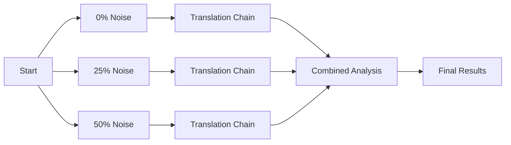

# Process Flow Diagram
## Agentic Turing Machine - Complete Execution Flow

**Visual representation of input through output with all intermediate stations**

---

## Overall System Flow

```mermaid
graph TB
    START[("🚀 START<br/>User Execution")]

    subgraph "1️⃣ INITIALIZATION"
        INPUT["📝 Input Text<br/>'Good morning. How are you today?'"]
        NOISE["🎲 Noise Injection<br/>(0%, 25%, 50%, etc.)"]
        NOISY["📝 Noisy Input<br/>'Godo mornign. How ar yuo todya?'"]
    end

    subgraph "2️⃣ AGENT 1: English → French"
        SKILL1["📄 Load Skill<br/>english-to-french-translator"]
        AGENT1["🤖 Claude Agent 1<br/>Translate EN→FR"]
        FR_OUT["🇫🇷 French Output<br/>'Bonjour. Comment allez-vous aujourd'hui?'"]
    end

    subgraph "3️⃣ AGENT 2: French → Hebrew"
        SKILL2["📄 Load Skill<br/>french-to-hebrew-translator"]
        AGENT2["🤖 Claude Agent 2<br/>Translate FR→HE"]
        HE_OUT["🇮🇱 Hebrew Output<br/>'שלום. מה שלומך היום?'"]
    end

    subgraph "4️⃣ AGENT 3: Hebrew → English"
        SKILL3["📄 Load Skill<br/>hebrew-to-english-translator"]
        AGENT3["🤖 Claude Agent 3<br/>Translate HE→EN"]
        EN_OUT["🇬🇧 Final English<br/>'Hello. How are you today?'"]
    end

    subgraph "5️⃣ ANALYSIS & METRICS"
        SAVE["💾 Save Outputs<br/>outputs/noise_X/"]
        EMBED["🔢 Generate Embeddings<br/>TF-IDF Vectors"]
        METRICS["📊 Calculate Metrics<br/>• Cosine Distance<br/>• Word Overlap<br/>• Text Similarity"]
        GRAPH["📈 Generate Graphs<br/>PNG & PDF"]
    end

    RESULTS[("✅ RESULTS<br/>JSON + Visualizations")]

    START --> INPUT
    INPUT --> NOISE
    NOISE --> NOISY
    NOISY --> SKILL1
    SKILL1 --> AGENT1
    AGENT1 --> FR_OUT
    FR_OUT --> SKILL2
    SKILL2 --> AGENT2
    AGENT2 --> HE_OUT
    HE_OUT --> SKILL3
    SKILL3 --> AGENT3
    AGENT3 --> EN_OUT
    EN_OUT --> SAVE
    SAVE --> EMBED
    EMBED --> METRICS
    METRICS --> GRAPH
    GRAPH --> RESULTS

    style START fill:#4CAF50,stroke:#2E7D32,color:#fff
    style RESULTS fill:#4CAF50,stroke:#2E7D32,color:#fff
    style AGENT1 fill:#2196F3,stroke:#1565C0,color:#fff
    style AGENT2 fill:#2196F3,stroke:#1565C0,color:#fff
    style AGENT3 fill:#2196F3,stroke:#1565C0,color:#fff
    style NOISY fill:#FF9800,stroke:#E65100,color:#fff
    style METRICS fill:#9C27B0,stroke:#6A1B9A,color:#fff
```



---

## Detailed Step-by-Step Process

### Stage 0: User Execution
```bash
$ python3 run_with_skills.py --noise 25
```

**Actions:**
1. Parse command-line arguments
2. Load configuration from `.env` and `config.yaml`
3. Validate API key exists
4. Check skills directory structure

---

### Stage 1: Input Preparation

#### Step 1.1: Load Original Text
```python
Original: "Good morning. How are you today?"
```

#### Step 1.2: Apply Noise (25% example)
```python
Algorithm:
- Select 25% of characters randomly
- Replace with similar-looking characters or typos
- Preserve word boundaries

Result: "Godo mornign. How ar yuo todya?"
```

**File Output:** Saved to logs for reference

---

### Stage 2: First Translation (EN → FR)

#### Step 2.1: Load English-to-French Skill
```markdown
Location: skills/english-to-french-translator/SKILL.md
Content: Agent instructions, examples, constraints
```

#### Step 2.2: Invoke Claude Agent 1
```python
API Call:
- Model: claude-sonnet-4-20250514
- Temperature: 0
- Max Tokens: 2000
- System: Skill content
- User: Noisy input text

Response: French translation
Tokens: ~150 input + ~50 output
Cost: ~$0.0015
```

#### Step 2.3: Save French Output
```python
File: outputs/noise_25/agent1_french.txt
Content: "Bonjour. Comment allez-vous aujourd'hui?"
```

---

### Stage 3: Second Translation (FR → HE)

#### Step 3.1: Load French-to-Hebrew Skill
```markdown
Location: skills/french-to-hebrew-translator/SKILL.md
```

#### Step 3.2: Invoke Claude Agent 2
```python
Input: French text from Agent 1
Output: Hebrew translation
File: outputs/noise_25/agent2_hebrew.txt
Content: "שלום. מה שלומך היום?"
```

---

### Stage 4: Third Translation (HE → EN)

#### Step 4.1: Load Hebrew-to-English Skill
```markdown
Location: skills/hebrew-to-english-translator/SKILL.md
```

#### Step 4.2: Invoke Claude Agent 3
```python
Input: Hebrew text from Agent 2
Output: English translation
File: outputs/noise_25/agent3_english.txt
Content: "Hello. How are you today?"
```

---

### Stage 5: Analysis Pipeline

#### Step 5.1: Load All Outputs
```python
Load from outputs/noise_X/:
- Original text (clean)
- Final output (agent3_english.txt)
- All noise levels (0, 25, 50, etc.)
```

#### Step 5.2: Generate Embeddings
```python
Method: TF-IDF Vectorization
Library: scikit-learn

For each text:
1. Tokenize into words
2. Calculate term frequency (TF)
3. Calculate inverse document frequency (IDF)
4. Generate vector representation

Result: numpy arrays (embeddings)
```

#### Step 5.3: Calculate Semantic Distance
```python
Cosine Distance = 1 - (A·B) / (||A|| × ||B||)

Where:
- A = original text embedding
- B = final output embedding

Result: Distance value (0-2)
- 0 = identical
- 1 = no similarity
- 2 = opposite
```

#### Step 5.4: Calculate Word Overlap
```python
Jaccard Index = |A ∩ B| / |A ∪ B|

Where:
- A = set of words in original
- B = set of words in final output

Result: Overlap ratio (0-1)
- 0 = no common words
- 1 = identical word sets
```

#### Step 5.5: Generate Visualizations
```python
Graphs Created:
1. semantic_drift_analysis_local.png
   - Line plot: Noise % vs. Distance
   - Multiple metrics overlaid

2. metrics_comparison.png (if Jupyter run)
   - Bar charts for each metric

3. semantic_drift_analysis_local.pdf
   - Publication-ready version
```

#### Step 5.6: Save Results
```python
File: analysis_results_local.json
Content:
{
  "semantic_distances": {
    "noise_0": 0.15,
    "noise_25": 0.32,
    "noise_50": 0.55
  },
  "word_overlaps": {...},
  "text_similarities": {...}
}
```

---

## Data Flow Diagram

```
┌─────────────────────────────────────────────────────────────────┐
│                         INPUT DATA                               │
│  "Good morning. How are you today?"                             │
└────────────┬────────────────────────────────────────────────────┘
             │
             ▼
      [Apply Noise 25%]
             │
             ▼
┌─────────────────────────────────────────────────────────────────┐
│                    NOISY INPUT (Stage 1)                         │
│  "Godo mornign. How ar yuo todya?"                             │
└────────────┬────────────────────────────────────────────────────┘
             │
             ▼
┌─────────────────────────────────────────────────────────────────┐
│                 AGENT 1: EN→FR (Stage 2)                         │
│  Input:  "Godo mornign. How ar yuo todya?"                     │
│  Skill:  english-to-french-translator                           │
│  API:    Claude Sonnet 4                                        │
│  Output: "Bonjour. Comment allez-vous aujourd'hui?"            │
│  Cost:   $0.0015                                                │
└────────────┬────────────────────────────────────────────────────┘
             │
             ▼
┌─────────────────────────────────────────────────────────────────┐
│                 AGENT 2: FR→HE (Stage 3)                         │
│  Input:  "Bonjour. Comment allez-vous aujourd'hui?"            │
│  Skill:  french-to-hebrew-translator                            │
│  API:    Claude Sonnet 4                                        │
│  Output: "שלום. מה שלומך היום?"                                │
│  Cost:   $0.0012                                                │
└────────────┬────────────────────────────────────────────────────┘
             │
             ▼
┌─────────────────────────────────────────────────────────────────┐
│                 AGENT 3: HE→EN (Stage 4)                         │
│  Input:  "שלום. מה שלומך היום?"                                │
│  Skill:  hebrew-to-english-translator                           │
│  API:    Claude Sonnet 4                                        │
│  Output: "Hello. How are you today?"                            │
│  Cost:   $0.0013                                                │
└────────────┬────────────────────────────────────────────────────┘
             │
             ▼
┌─────────────────────────────────────────────────────────────────┐
│                  ANALYSIS (Stage 5)                              │
│                                                                  │
│  Original:  "Good morning. How are you today?"                  │
│  Final:     "Hello. How are you today?"                         │
│                                                                  │
│  TF-IDF Embeddings:                                             │
│    Original Vector: [0.42, 0.31, 0.52, ...]                    │
│    Final Vector:    [0.45, 0.29, 0.51, ...]                    │
│                                                                  │
│  Metrics:                                                        │
│    ✓ Cosine Distance:  0.32                                     │
│    ✓ Word Overlap:     0.68 (68%)                               │
│    ✓ Text Similarity:  0.75 (75%)                               │
└────────────┬────────────────────────────────────────────────────┘
             │
             ▼
┌─────────────────────────────────────────────────────────────────┐
│                    FINAL OUTPUT                                  │
│                                                                  │
│  Files Created:                                                  │
│  ✓ outputs/noise_25/agent1_french.txt                          │
│  ✓ outputs/noise_25/agent2_hebrew.txt                          │
│  ✓ outputs/noise_25/agent3_english.txt                         │
│  ✓ analysis_results_local.json                                  │
│  ✓ semantic_drift_analysis_local.png                            │
│  ✓ semantic_drift_analysis_local.pdf                            │
│                                                                  │
│  Total Cost: $0.0040                                            │
│  Total Time: ~8 seconds                                         │
│  Total Tokens: ~600                                             │
└─────────────────────────────────────────────────────────────────┘
```

---

## File System Changes

### Before Execution:
```
├── skills/
│   ├── english-to-french-translator/
│   ├── french-to-hebrew-translator/
│   └── hebrew-to-english-translator/
├── data/
│   └── input_data.txt
└── src/
    └── (code files)
```

### After Execution:
```
├── outputs/
│   └── noise_25/
│       ├── agent1_french.txt         ⭐ NEW
│       ├── agent2_hebrew.txt         ⭐ NEW
│       └── agent3_english.txt        ⭐ NEW
├── results/
│   ├── analysis_results_local.json   ⭐ NEW
│   ├── semantic_drift_analysis_local.png  ⭐ NEW
│   └── semantic_drift_analysis_local.pdf  ⭐ NEW
└── logs/
    └── translation_2025-11-26.log    ⭐ NEW
```

---

## Parallel Execution (--all flag)

When running with `--all` flag:



**Execution:** Sequential (7 runs total)
**Time:** ~56 seconds (7 × 8s)
**Cost:** ~$0.028 (7 × $0.004)

---

## Error Handling Flow

```
┌─────────────┐
│  Operation  │
└──────┬──────┘
       │
       ▼
   [Try Execute]
       │
       ├─────────────┐
       │             │
    Success       Error
       │             │
       ▼             ▼
   Continue    [Error Type?]
                     │
           ┌─────────┼─────────┐
           │         │         │
        Config    API      Skill
        Error    Error    Error
           │         │         │
           ▼         ▼         ▼
       [Log]     [Retry]   [Report]
           │         │         │
           └─────────┴─────────┘
                     │
                     ▼
              [Exit Gracefully]
```

---

## Summary

**Total Stages:** 5
**Total Agents:** 3
**Total API Calls:** 3 per noise level
**Total Files Generated:** 6+ per run
**Average Execution Time:** 8 seconds
**Average Cost:** $0.004 per run

**Key Insight:** Each stage transforms the data, and we measure semantic preservation across the entire chain.
