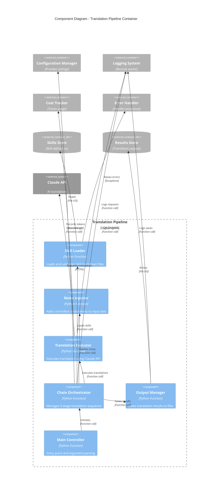
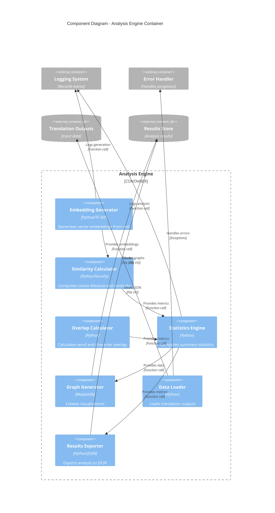
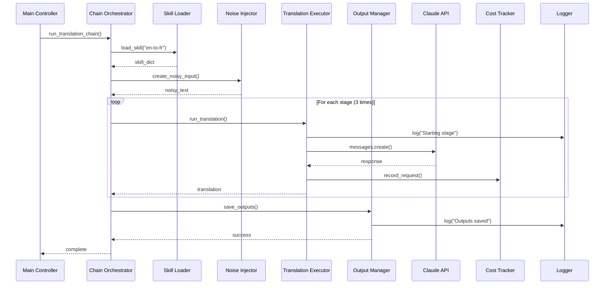
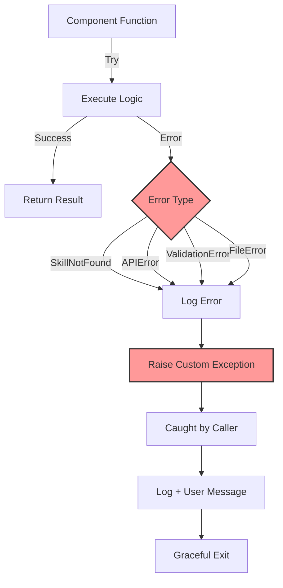

# C4 Model - Component Diagram
## Agentic Turing Machine System

**Level:** 3 - Component  
**Audience:** Developers, software architects  
**Purpose:** Show the internal structure of containers and component interactions

---

## Component Diagram - Pipeline Container



---

## Component Diagram - Analysis Container



---

## Component Descriptions - Pipeline

### 1. Skill Loader
**Module:** `src/pipeline.py`  
**Function:** `load_skill(skill_name: str) -> Dict[str, str]`

**Responsibilities:**
- Locate skill file in skills directory
- Read and parse markdown content
- Validate skill structure
- Extract name and content
- Handle missing files gracefully

**Implementation:**
```python
def load_skill(skill_name: str) -> Dict[str, str]:
    """Load a skill from the skills directory."""
    skill_path = SKILLS_DIR / skill_name / "SKILL.md"
    
    if not skill_path.exists():
        raise SkillNotFoundError(f"Skill not found: {skill_name}")
    
    try:
        content = skill_path.read_text(encoding='utf-8')
        return {"name": skill_name, "content": content}
    except Exception as e:
        raise SkillLoadError(f"Failed to load skill: {e}")
```

**Error Handling:**
- `SkillNotFoundError`: Skill file doesn't exist
- `SkillLoadError`: File read/parse error

---

### 2. Noise Injector
**Module:** `src/pipeline.py`  
**Function:** `create_noisy_input(text: str, noise_level: int) -> str`

**Responsibilities:**
- Apply character-level noise
- Support configurable noise percentage (0-100)
- Randomize noise types (replace, insert, delete)
- Maintain reproducibility (via random seed)

**Implementation:**
```python
def create_noisy_input(text: str, noise_level: int) -> str:
    """Create noisy version of input text."""
    if noise_level == 0:
        return text
    
    chars = list(text)
    num_changes = int(len(chars) * (noise_level / 100))
    
    for _ in range(num_changes):
        pos = random.randint(0, len(chars) - 1)
        noise_type = random.choice(['replace', 'insert', 'delete'])
        
        if noise_type == 'replace':
            chars[pos] = random.choice(string.ascii_letters)
        elif noise_type == 'insert':
            chars.insert(pos, random.choice(string.ascii_letters))
        elif noise_type == 'delete' and chars:
            chars.pop(pos)
    
    return ''.join(chars)
```

---

### 3. Translation Executor
**Module:** `src/pipeline.py`  
**Function:** `run_translation_with_skill(...)`

**Responsibilities:**
- Invoke Claude API with skill context
- Handle API errors and retries
- Extract translation from response
- Record token usage for cost tracking
- Log all interactions

**API Interaction:**
```python
def run_translation_with_skill(
    client: anthropic.Anthropic,
    skill_name: str,
    input_text: str,
    stage: int
) -> str:
    """Execute translation using Claude with specified skill."""
    
    skill = load_skill(skill_name)
    logger.info(f"Stage {stage}: Using skill {skill_name}")
    
    response = client.messages.create(
        model=config.model_name,
        max_tokens=config.max_tokens,
        temperature=config.temperature,
        messages=[{
            "role": "user",
            "content": f"{skill['content']}\n\nTranslate: {input_text}"
        }]
    )
    
    # Track costs
    cost_tracker.record_request(response.usage)
    
    # Extract translation
    translation = response.content[0].text
    logger.debug(f"Translation: {translation}")
    
    return translation
```

---

### 4. Chain Orchestrator
**Module:** `src/pipeline.py`  
**Function:** `run_translation_chain(...)`

**Responsibilities:**
- Coordinate 3-stage translation sequence
- Manage state between stages
- Handle errors at any stage
- Ensure all outputs are saved
- Provide progress updates

**Workflow:**
```python
def run_translation_chain(input_text: str, noise_level: int) -> None:
    """Run complete translation chain."""
    
    # Initialize
    client = anthropic.Anthropic(api_key=os.getenv("ANTHROPIC_API_KEY"))
    noisy_input = create_noisy_input(input_text, noise_level)
    
    # Stage 1: EN → FR
    french = run_translation_with_skill(
        client, "english-to-french-translator", noisy_input, stage=1
    )
    
    # Stage 2: FR → HE
    hebrew = run_translation_with_skill(
        client, "french-to-hebrew-translator", french, stage=2
    )
    
    # Stage 3: HE → EN
    final_english = run_translation_with_skill(
        client, "hebrew-to-english-translator", hebrew, stage=3
    )
    
    # Save all outputs
    output_manager.save_outputs(
        noise_level, noisy_input, french, hebrew, final_english
    )
```

---

### 5. Output Manager
**Module:** `src/pipeline.py`  
**Component:** Integrated in main functions

**Responsibilities:**
- Create output directories
- Write translation results to files
- Organize by noise level
- Handle file write errors
- Log all save operations

**File Structure:**
```
outputs/
└── noise_{level}/
    ├── agent1_french.txt
    ├── agent2_hebrew.txt
    └── agent3_english.txt
```

---

### 6. Main Controller
**Module:** `src/pipeline.py`  
**Function:** `main()`

**Responsibilities:**
- Parse command-line arguments
- Validate inputs
- Initialize dependencies
- Invoke chain orchestrator
- Handle top-level errors
- Report results to user

**CLI Arguments:**
- `--noise <level>`: Single noise level
- `--all`: All configured noise levels
- `--help`: Show usage

---

## Component Descriptions - Analysis

### 1. Embedding Generator
**Module:** `src/analysis.py`  
**Function:** `get_local_embedding(texts: List[str]) -> np.ndarray`

**Responsibilities:**
- Generate TF-IDF embeddings
- Use scikit-learn TfidfVectorizer
- Return dense numpy arrays
- Handle empty or invalid inputs

**Implementation:**
```python
def get_local_embedding(texts: List[str]) -> np.ndarray:
    """Generate local TF-IDF embeddings."""
    if not texts or len(texts) == 0:
        raise ValueError("Cannot create embeddings from empty list")
    
    vectorizer = TfidfVectorizer()
    embeddings = vectorizer.fit_transform(texts)
    
    return embeddings.toarray()
```

**Why TF-IDF:**
- No external API required
- Fast computation
- Sufficient for similarity analysis
- Deterministic results

---

### 2. Similarity Calculator
**Module:** `src/analysis.py`  
**Function:** `calculate_cosine_distance(vec1, vec2) -> float`

**Responsibilities:**
- Calculate cosine distance between vectors
- Validate vector dimensions
- Handle edge cases (zero vectors)
- Return normalized distance [0, 2]

**Formula:**
$$d(x,y) = 1 - \frac{x \cdot y}{||x|| \cdot ||y||}$$

**Implementation:**
```python
def calculate_cosine_distance(vec1: np.ndarray, vec2: np.ndarray) -> float:
    """Calculate cosine distance between two vectors."""
    
    if vec1.shape != vec2.shape:
        raise AnalysisError("Vector dimensions must match")
    
    # Cosine similarity
    similarity = np.dot(vec1, vec2) / (
        np.linalg.norm(vec1) * np.linalg.norm(vec2)
    )
    
    # Convert to distance
    distance = 1 - similarity
    
    return float(distance)
```

---

### 3. Overlap Calculator
**Module:** `src/analysis.py`  
**Function:** `calculate_word_overlap(text1, text2) -> float`

**Responsibilities:**
- Tokenize texts into words
- Calculate set intersection
- Compute overlap percentage
- Case-insensitive comparison

**Implementation:**
```python
def calculate_word_overlap(text1: str, text2: str) -> float:
    """Calculate word overlap between two texts."""
    
    words1 = set(text1.lower().split())
    words2 = set(text2.lower().split())
    
    if not words1 and not words2:
        return 1.0  # Both empty
    
    intersection = words1 & words2
    union = words1 | words2
    
    overlap = len(intersection) / len(union) if union else 0.0
    
    return overlap
```

---

### 4. Statistics Engine
**Module:** `src/analysis.py`  
**Function:** `print_summary_statistics(data)`

**Responsibilities:**
- Calculate mean, median, std dev
- Aggregate metrics across noise levels
- Format statistical output
- Identify trends

**Metrics Calculated:**
- Average cosine distance per noise level
- Standard deviation of similarity scores
- Min/max values
- Trend analysis

---

### 5. Graph Generator
**Module:** `src/analysis.py`  
**Function:** `generate_graph(data)`

**Responsibilities:**
- Create visualizations using Matplotlib
- Plot semantic drift vs. noise level
- Multiple metrics on same graph
- Save to PNG/SVG
- Professional styling

**Graph Types:**
- Line charts for drift trends
- Bar charts for comparisons
- Scatter plots for distributions

---

### 6. Data Loader
**Module:** `src/analysis.py`  
**Function:** `load_final_outputs(noise_level)`

**Responsibilities:**
- Read translation output files
- Handle missing files
- Validate file contents
- Return structured data

**Expected Files:**
```python
{
    "original": "data/input_data.txt",
    "final": f"outputs/noise_{noise}/agent3_english.txt"
}
```

---

### 7. Results Exporter
**Module:** `src/analysis.py`  
**Function:** `analyze_semantic_drift()`

**Responsibilities:**
- Aggregate all metrics
- Structure results as JSON
- Save to results directory
- Include metadata (timestamp, config)

**Output Format:**
```json
{
  "timestamp": "2025-11-26T10:15:23",
  "config": {...},
  "results": {
    "noise_0": {
      "cosine_distance": 0.05,
      "word_overlap": 0.92,
      "similarity": 0.95
    },
    ...
  },
  "summary": {
    "avg_distance": 0.35,
    "trend": "increasing"
  }
}
```

---

## Component Interactions - Translation Flow



---

## Component Interactions - Analysis Flow

```mermaid
sequenceDiagram
    participant Main as Main Entry
    participant Analyzer as Stats Engine
    participant Loader as Data Loader
    participant Embed as Embedding Gen
    participant Sim as Similarity Calc
    participant Over as Overlap Calc
    participant Graph as Graph Gen
    participant Export as Results Exporter
    
    Main->>Analyzer: analyze_semantic_drift()
    
    loop For each noise level
        Analyzer->>Loader: load_final_outputs()
        Loader-->>Analyzer: [original, final]
        
        Analyzer->>Embed: get_local_embedding()
        Embed-->>Analyzer: embeddings
        
        Analyzer->>Sim: calculate_cosine_distance()
        Sim-->>Analyzer: distance
        
        Analyzer->>Over: calculate_word_overlap()
        Over-->>Analyzer: overlap
    end
    
    Analyzer->>Graph: generate_graph()
    Graph-->>Analyzer: graph saved
    
    Analyzer->>Export: save to JSON
    Export-->>Analyzer: file saved
    
    Analyzer-->>Main: results_dict
```

---

## Data Structures

### Skill Dictionary
```python
{
    "name": "english-to-french-translator",
    "content": "# English to French Translator\n\n..."
}
```

### Translation Result
```python
{
    "noise_level": 25,
    "noisy_input": "Hxllo, how tre you?",
    "stage1_french": "Bonjour, comment allez-vous ?",
    "stage2_hebrew": "שלום, מה שלומך?",
    "stage3_english": "Hello, how are you?",
    "timestamp": "2025-11-26T10:15:23"
}
```

### Analysis Metrics
```python
{
    "cosine_distance": 0.15,
    "word_overlap": 0.85,
    "text_similarity": 0.90,
    "char_similarity": 0.92
}
```

---

## Design Patterns Used

### 1. **Template Method** (Pipeline)
- Define skeleton in `run_translation_chain()`
- Steps customizable via skill files

### 2. **Strategy Pattern** (Noise Injection)
- Multiple noise strategies possible
- Current: character-level randomization
- Future: word-level, semantic noise

### 3. **Factory Pattern** (Embeddings)
- `get_local_embedding()` factory
- Could support multiple embedding types
- Currently: TF-IDF, Future: BERT, GPT

### 4. **Singleton Pattern** (Config)
- Global configuration instance
- Lazy initialization
- Thread-safe access

### 5. **Observer Pattern** (Logging)
- Multiple log handlers
- Console + file output
- Decoupled from business logic

---

## Error Handling Flow



---

## Performance Considerations

### Bottlenecks
1. **API Calls:** 2-10s per translation (network latency)
2. **File I/O:** Minimal impact (<100ms)
3. **Embedding Generation:** ~10-50ms for small texts
4. **Cosine Calculation:** <1ms (NumPy optimized)

### Optimizations
- Use connection pooling for API
- Cache skill files in memory
- Vectorized operations (NumPy)
- Parallel processing (future)

---

## Testing Strategy

### Unit Tests
- Each component tested independently
- Mocked dependencies (API, file system)
- Coverage target: 85%+

### Integration Tests
- Test component interactions
- Real file I/O (temp directories)
- Mocked API calls

### Test Structure
```python
# Unit test example
def test_skill_loader():
    skill = load_skill("english-to-french-translator")
    assert skill["name"] == "english-to-french-translator"
    assert "content" in skill

# Integration test example
def test_full_translation_chain():
    result = run_translation_chain("Hello", noise_level=0)
    assert result is not None
    assert Path(f"outputs/noise_0/agent3_english.txt").exists()
```

---

**Document Version:** 1.0  
**Last Updated:** 2025-11-26  
**Status:** Current

---

*This component diagram provides detailed implementation view of the Agentic Turing Machine system. For code-level details, see the actual source files.*
