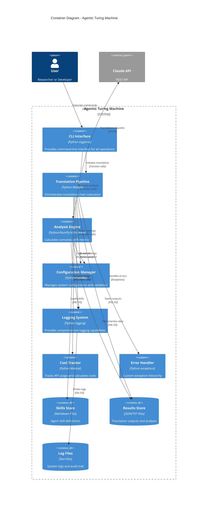
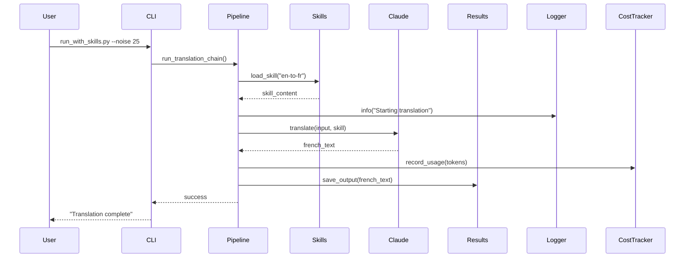
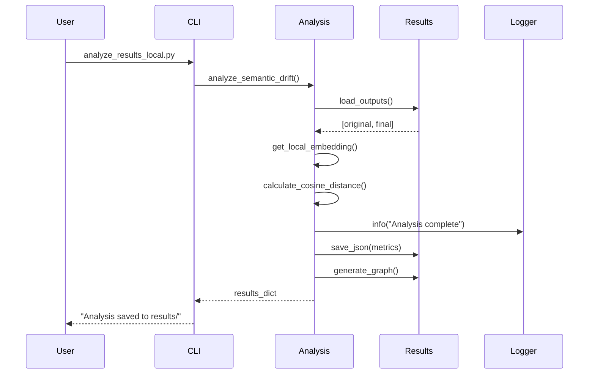
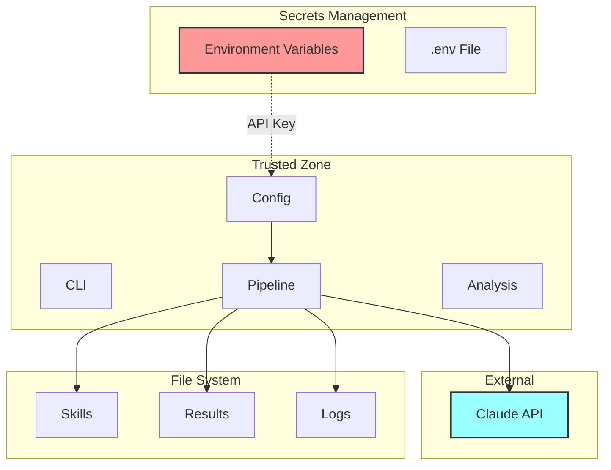
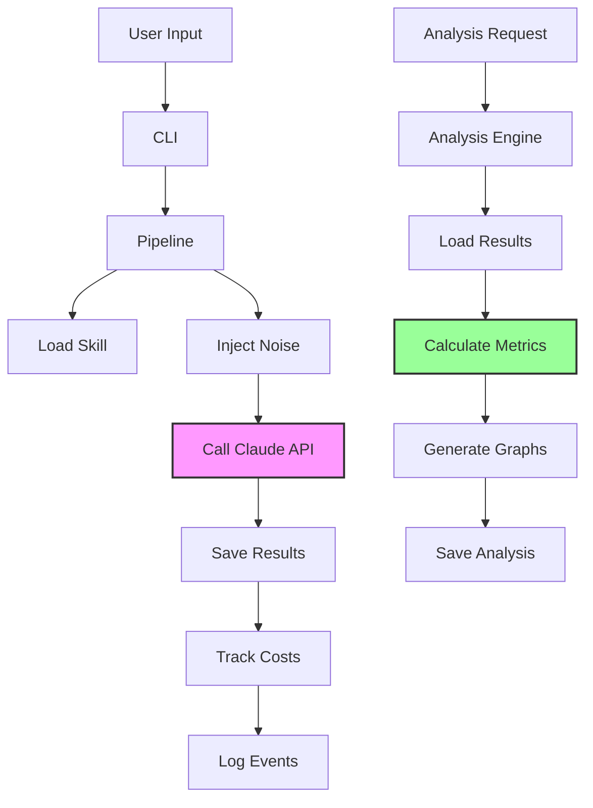

# C4 Model - Container Diagram
## Agentic Turing Machine System

**Level:** 2 - Container  
**Audience:** Technical stakeholders, architects, developers  
**Purpose:** Show the high-level technology choices and container interactions

---

## Container Diagram



---

## Container Descriptions

### 1. CLI Interface
**Technology:** Python argparse  
**Purpose:** Provides user-facing command-line interface

**Responsibilities:**
- Parse command-line arguments
- Validate user inputs
- Display results and errors
- Provide help documentation

**Entry Points:**
- `run_with_skills.py` - Main pipeline execution
- `test_agent.py` - Individual agent testing
- `analyze_results_local.py` - Results analysis

**Interfaces:**
```python
# Command patterns
python run_with_skills.py --noise 25
python test_agent.py <skill_name> <input_text>
python test_agent.py --list
python analyze_results_local.py
```

---

### 2. Translation Pipeline
**Technology:** Python module (`src/pipeline.py`)  
**Purpose:** Core orchestration of translation workflow

**Responsibilities:**
- Load skills from markdown files
- Inject noise into input text
- Execute translation chain (3 stages)
- Manage API interactions
- Coordinate with other containers

**Key Functions:**
```python
load_skill(skill_name: str) -> Dict[str, str]
create_noisy_input(text: str, noise_level: int) -> str
run_translation_with_skill(client, skill_name, input_text, stage) -> str
run_translation_chain(input_text: str, noise_level: int) -> None
```

**Data Flow:**
1. Load configuration
2. Load skills (EN→FR, FR→HE, HE→EN)
3. Create noisy input
4. Execute stage 1: EN→FR
5. Execute stage 2: FR→HE
6. Execute stage 3: HE→EN
7. Save all outputs
8. Track costs

---

### 3. Analysis Engine
**Technology:** Python/NumPy/scikit-learn (`src/analysis.py`)  
**Purpose:** Calculate semantic drift and similarity metrics

**Responsibilities:**
- Load translation outputs
- Generate embeddings (TF-IDF)
- Calculate cosine distance
- Compute word overlap
- Generate visualizations
- Export results to JSON

**Key Functions:**
```python
get_local_embedding(texts: List[str]) -> np.ndarray
calculate_cosine_distance(vec1, vec2) -> float
calculate_text_similarity(text1: str, text2: str) -> float
calculate_word_overlap(text1: str, text2: str) -> float
analyze_semantic_drift() -> Dict[str, Any]
generate_graph(data: Dict) -> None
```

**Metrics:**
- **Cosine Distance:** Vector similarity using TF-IDF
- **Word Overlap:** Percentage of shared words
- **Character Similarity:** Edit distance based

---

### 4. Configuration Manager
**Technology:** Python/PyYAML (`src/config.py`)  
**Purpose:** Centralized configuration management

**Responsibilities:**
- Load YAML configuration files
- Read environment variables
- Provide default values
- Validate configuration
- Type conversion

**Configuration Structure:**
```yaml
model:
  name: "claude-3-5-sonnet-20241022"
  temperature: 0.7
  max_tokens: 1000

experiment:
  noise_levels: [0, 25, 50, 75, 100]
  
paths:
  output_dir: "outputs"
  results_dir: "results"

features:
  cost_tracking: true
  plugins_enabled: false
```

**Interface:**
```python
config = Config()
model_name = config.model_name
noise_levels = config.noise_levels
```

---

### 5. Logging System
**Technology:** Python logging module (`src/logger.py`)  
**Purpose:** Comprehensive logging and audit trail

**Responsibilities:**
- Configure log handlers
- Format log messages
- Write to file and console
- Separate logs per experiment
- Support multiple log levels

**Log Levels:**
- **DEBUG:** Detailed diagnostic info
- **INFO:** General informational messages
- **WARNING:** Warning messages
- **ERROR:** Error messages
- **CRITICAL:** Critical failures

**Log Format:**
```
2025-11-26 10:15:23,456 - pipeline - INFO - Starting translation chain
2025-11-26 10:15:24,123 - pipeline - DEBUG - Loaded skill: english-to-french-translator
```

---

### 6. Cost Tracker
**Technology:** Python module (`src/cost_tracker.py`)  
**Purpose:** Track API usage and calculate costs

**Responsibilities:**
- Record token usage per request
- Calculate costs based on model pricing
- Aggregate costs per experiment
- Export cost reports
- Support multiple Claude models

**Tracking Data:**
```python
{
    "model": "claude-3-5-sonnet-20241022",
    "input_tokens": 1234,
    "output_tokens": 567,
    "input_cost": 0.003702,
    "output_cost": 0.008505,
    "total_cost": 0.012207
}
```

**Cost Calculation:**
- Sonnet: $3/MTok input, $15/MTok output
- Opus: $15/MTok input, $75/MTok output
- Haiku: $0.25/MTok input, $1.25/MTok output

---

### 7. Error Handler
**Technology:** Python exceptions (`src/errors.py`)  
**Purpose:** Custom exception hierarchy for precise error handling

**Exception Types:**
```python
class ATMError(Exception):
    """Base exception"""

class SkillNotFoundError(ATMError):
    """Skill file not found"""

class SkillLoadError(ATMError):
    """Error loading skill"""

class TranslationError(ATMError):
    """Translation failed"""

class APIError(ATMError):
    """API call failed"""

class ValidationError(ATMError):
    """Input validation failed"""

class ConfigurationError(ATMError):
    """Configuration invalid"""

class AnalysisError(ATMError):
    """Analysis failed"""

class FileOperationError(ATMError):
    """File operation failed"""
```

**Usage Pattern:**
```python
try:
    skill = load_skill(skill_name)
except SkillNotFoundError as e:
    logger.error(f"Skill not found: {e}")
    sys.exit(1)
```

---

### 8. Skills Store
**Technology:** Markdown files in `skills/` directory  
**Purpose:** Store agent skill definitions

**Structure:**
```
skills/
├── english-to-french-translator/
│   └── SKILL.md
├── french-to-hebrew-translator/
│   └── SKILL.md
└── hebrew-to-english-translator/
    └── SKILL.md
```

**Skill File Format:**
```markdown
# Skill Name

## Description
Translates text from English to French

## Instructions
[Detailed prompt for Claude]

## Examples
Input: Hello
Output: Bonjour
```

---

### 9. Results Store
**Technology:** JSON and text files  
**Purpose:** Persistent storage of outputs and analysis

**Directory Structure:**
```
outputs/
├── noise_0/
│   ├── agent1_french.txt
│   ├── agent2_hebrew.txt
│   └── agent3_english.txt
├── noise_25/
└── ...

results/
├── analysis_results_local.json
├── cost_analysis.json
└── semantic_drift.png
```

**Data Formats:**
- **Translation outputs:** Plain text files
- **Analysis results:** JSON with metrics
- **Cost reports:** JSON with breakdown
- **Visualizations:** PNG/SVG graphs

---

### 10. Log Files
**Technology:** Text files in `logs/` directory  
**Purpose:** System logs and audit trail

**Log Organization:**
```
logs/
├── atm_20251126_101523.log
├── atm_20251126_143012.log
└── ...
```

**Retention:** Configurable (default: keep all)

---

## Container Interactions

### Translation Flow


### Analysis Flow


---

## Technology Choices

| Container | Technology | Justification |
|-----------|------------|---------------|
| CLI Interface | argparse | Standard library, simple, sufficient |
| Pipeline | Pure Python | No heavy dependencies needed |
| Analysis | NumPy/scikit-learn | Efficient vector operations, TF-IDF |
| Config | PyYAML | Human-readable, flexible |
| Logger | Python logging | Standard, well-tested, configurable |
| Cost Tracker | Pure Python | Simple calculations, no external deps |
| Error Handler | Python exceptions | Native, efficient, Pythonic |
| Skills Store | Markdown | Human-readable, easy to edit |
| Results Store | JSON/TXT | Universal formats, easy parsing |
| Logs | Text files | Simple, debuggable, standard |

---

## Scalability Considerations

### Current Limitations
- Single-threaded execution
- Local file storage only
- No caching of API results
- Sequential pipeline stages

### Future Enhancements
- Parallel processing of multiple noise levels
- Database storage for large-scale experiments
- API result caching
- Distributed execution

---

## Security Boundaries



---

## Data Flow Summary



---

**Document Version:** 1.0  
**Last Updated:** 2025-11-26  
**Status:** Current

---

*This container diagram shows the major technical building blocks of the Agentic Turing Machine system. For implementation details, see Component diagram.*
