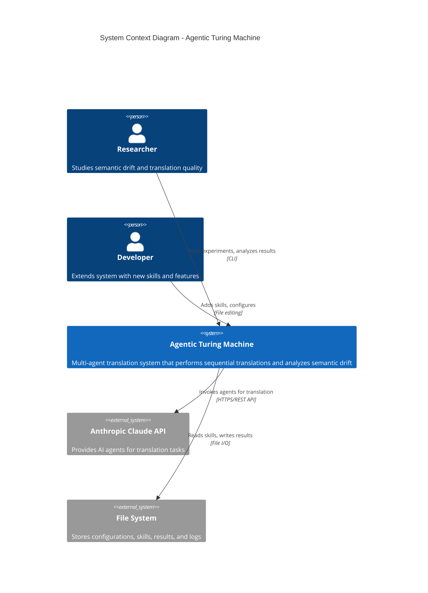
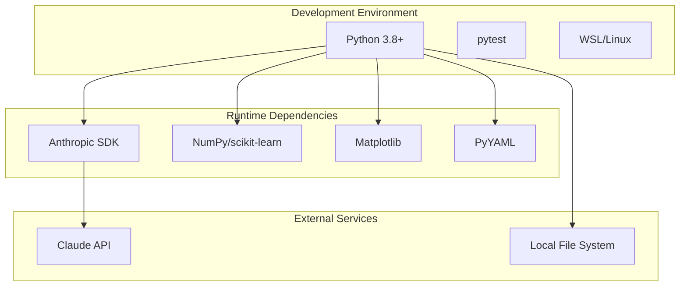
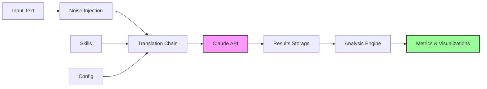
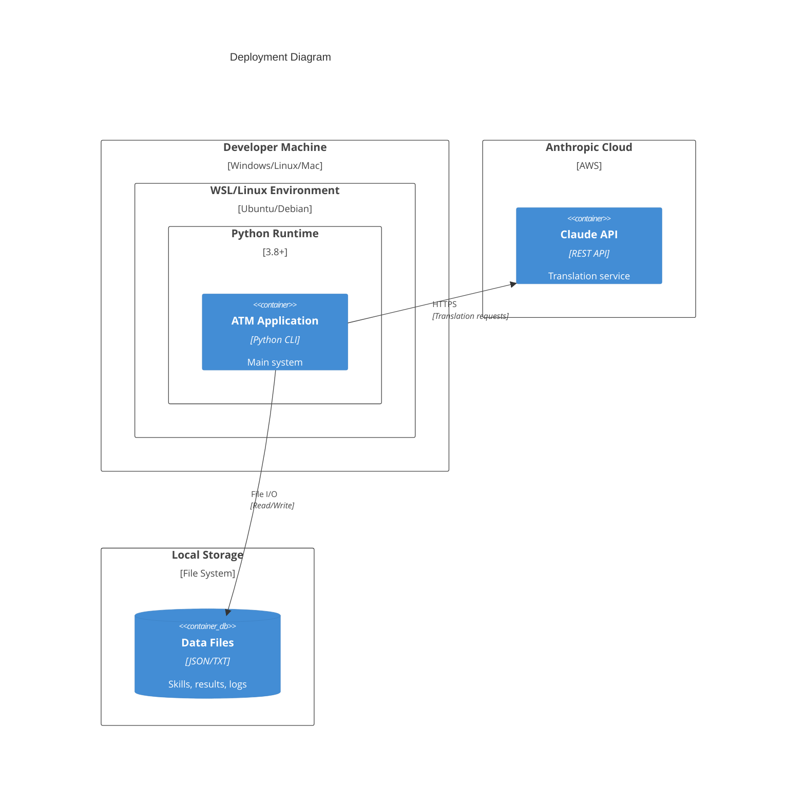
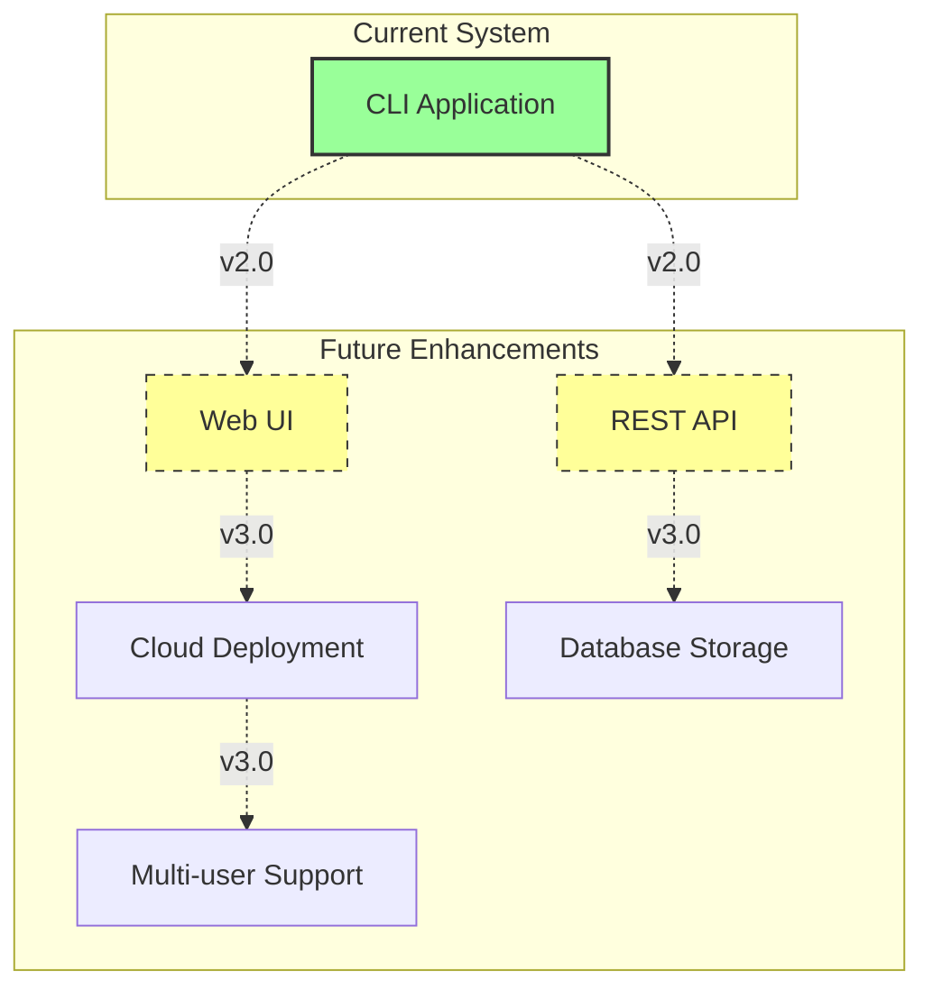

# C4 Model - Context Diagram
## Agentic Turing Machine System

**Level:** 1 - System Context  
**Audience:** Technical and non-technical stakeholders  
**Purpose:** Show how the Agentic Turing Machine fits into the wider ecosystem

---

## Context Diagram



---

## System Description

### Agentic Turing Machine
A Python-based multi-agent translation system that:
- Performs sequential translations through multiple language pairs
- Injects controlled noise to simulate real-world text imperfections
- Analyzes semantic drift using multiple similarity metrics
- Tracks API costs and provides comprehensive logging
- Supports extensible skill-based agent architecture

### Key Characteristics
- **Type:** Command-line application
- **Language:** Python 3.8+
- **Deployment:** Local execution
- **Scale:** Single-user, research-oriented

---

## External Systems

### 1. Anthropic Claude API
**Purpose:** Provides large language model capabilities for translation tasks

**Interaction:**
- System sends translation requests with context from skills
- Claude processes text and returns translations
- API tracks token usage for cost calculation

**Key Points:**
- Requires API key authentication
- Subject to rate limits based on tier
- Costs vary by model (Sonnet, Opus, Haiku)
- Typical latency: 2-10 seconds per request

---

### 2. File System
**Purpose:** Persistent storage for all system data

**Interaction:**
- **Read:** Skills, configuration, input data
- **Write:** Translation outputs, analysis results, logs, cost reports

**Key Points:**
- No database required
- Directory-based organization
- JSON and text file formats
- Local storage only

---

## User Personas

### Researcher
**Goals:**
- Conduct systematic experiments on translation quality
- Measure semantic drift across different noise levels
- Analyze cost-performance tradeoffs
- Generate academic-quality results

**Interactions:**
- Runs pipeline with various configurations
- Analyzes results using provided tools
- Reviews Jupyter notebooks with statistical analysis
- Exports data for further research

**Technical Level:** Intermediate - comfortable with CLI and Python

---

### Developer
**Goals:**
- Extend system with new translation skills
- Add new analysis metrics
- Integrate additional language pairs
- Customize pipeline behavior

**Interactions:**
- Creates new skill markdown files
- Modifies configuration files
- Extends core modules
- Writes additional tests

**Technical Level:** Advanced - proficient in Python development

---

## Key Scenarios

### Scenario 1: Run Translation Experiment
```
Researcher → CLI Command → ATM → Claude API → Translation
         ↓
    Analysis → Results JSON + Visualizations
```

### Scenario 2: Analyze Existing Results
```
Researcher → Analysis Script → ATM → File System → Results
         ↓
    Statistical Analysis + Graphs
```

### Scenario 3: Add New Translation Skill
```
Developer → Create SKILL.md → File System
         ↓
    ATM loads skill → Tests with test_agent.py
```

---

## System Boundaries

### Inside the System
✅ Translation pipeline orchestration  
✅ Noise injection logic  
✅ Semantic drift analysis  
✅ Cost tracking and reporting  
✅ Logging and error handling  
✅ Configuration management  

### Outside the System
❌ Actual AI translation (delegated to Claude)  
❌ Cloud infrastructure  
❌ User authentication  
❌ Web interface  
❌ Database management  
❌ Real-time collaboration  

---

## Technology Context



---

## Data Flow Overview



---

## Quality Attributes

| Attribute | Requirement | Achieved Through |
|-----------|-------------|------------------|
| **Reliability** | 95%+ error coverage | Custom exception hierarchy, comprehensive tests |
| **Performance** | <30s per experiment | Efficient API calls, local embeddings |
| **Maintainability** | A+ code quality | Modular design, comprehensive docs |
| **Usability** | Clear CLI | argparse, help messages, examples |
| **Security** | No secret exposure | Environment variables, .env files |
| **Extensibility** | Easy skill addition | Plugin architecture, skill templates |

---

## Deployment Context



---

## Future Context (Potential Extensions)



---

## Compliance & Standards

- **ISO/IEC 25010:** Software quality model compliance
- **Python PEP 8:** Code style guidelines
- **C4 Model:** Architecture documentation standard
- **Semantic Versioning:** Version numbering

---

**Document Version:** 1.0  
**Last Updated:** 2025-11-26  
**Status:** Current

---

*This context diagram provides the highest-level view of the Agentic Turing Machine system and its ecosystem. For more detailed views, see Container and Component diagrams.*
