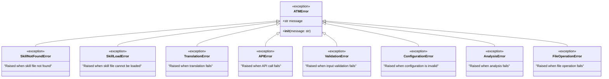

# UML Class Diagram
## Agentic Turing Machine - System Architecture

**Purpose:** Show the static structure, classes, attributes, methods, and relationships  
**Scope:** Core modules and their interactions

---

## Complete Class Diagram


---

## Module Details

### Configuration Module (`src/config.py`)


**Key Methods:**
- `get(key, default)`: Retrieve configuration value with fallback
- `_convert_type(value)`: Convert string values to appropriate types
- `validate()`: Ensure required configuration is present

**Properties:**
- Read-only access to configuration values
- Type-safe property accessors
- Environment variable overrides

---

### Error Hierarchy (`src/errors.py`)



**Design Pattern:** Exception Hierarchy  
**Purpose:** Precise error handling and recovery

---

### Cost Tracker Module (`src/cost_tracker.py`)


**Model Pricing:**
```python
{
    "claude-3-5-sonnet": {"input": 3.00, "output": 15.00},  # per MTok
    "claude-3-opus": {"input": 15.00, "output": 75.00},
    "claude-3-haiku": {"input": 0.25, "output": 1.25}
}
```

---

### Pipeline Module (`src/pipeline.py`)


---

### Analysis Module (`src/analysis.py`)


---

## Design Patterns Used

### 1. Singleton Pattern
**Class:** `Config`  
**Purpose:** Ensure single configuration instance  
**Implementation:**
```python
class Config:
    _instance = None
    
    def __new__(cls, *args, **kwargs):
        if cls._instance is None:
            cls._instance = super().__new__(cls)
        return cls._instance
```

---

### 2. Factory Pattern
**Class:** `SkillLoader`  
**Purpose:** Create `Skill` objects from files  
**Implementation:**
```python
class SkillLoader:
    def load(self, skill_name: str) -> Skill:
        # Read file, parse, create Skill object
        return Skill(name=skill_name, content=content)
```

---

### 3. Strategy Pattern
**Class:** `NoiseInjector`  
**Purpose:** Different noise application strategies  
**Strategies:** Replace, Insert, Delete characters

---

### 4. Template Method Pattern
**Class:** `ChainOrchestrator`  
**Purpose:** Define translation chain skeleton  
**Steps:**
1. Load skills
2. Apply noise
3. Execute stage 1
4. Execute stage 2
5. Execute stage 3
6. Save outputs

---

### 5. Observer Pattern (Implicit)
**Class:** `CostTracker`  
**Purpose:** Observe API calls and record costs  
**Observers:** Logger, CostTracker, MetricsCollector

---

## Class Relationships Summary

| Relationship | Type | Description |
|--------------|------|-------------|
| Config → ConfigurationError | Dependency | Throws exception on invalid config |
| CostTracker ◆ RequestRecord | Composition | CostTracker contains RequestRecords |
| Pipeline → Config | Association | Pipeline uses Config |
| TranslationExecutor → CostTracker | Association | Executor uses CostTracker |
| ChainOrchestrator → TranslationExecutor | Association | Orchestrator uses Executor |
| SkillLoader ⇢ Skill | Dependency | Loader creates Skills |
| AnalysisEngine → EmbeddingGenerator | Dependency | Engine uses Generator |

---

## Dependency Graph


---

## Object Creation Sequence


---

## Attributes and Methods Summary

### Config Class
**Attributes:**
- `_config: Dict[str, Any]` - Configuration dictionary
- `_config_path: Path` - Path to config file
- `_instance: Config` - Singleton instance

**Methods:**
- `get(key, default)` - Get config value
- `validate()` - Validate configuration
- Properties for each config value

---

### CostTracker Class
**Attributes:**
- `model_name: str` - Model being tracked
- `requests: List[RequestRecord]` - All requests
- `total_cost: float` - Cumulative cost

**Methods:**
- `record_request(usage)` - Record API usage
- `calculate_cost(in, out)` - Calculate cost
- `export_report(path)` - Export to JSON

---

### TranslationExecutor Class
**Attributes:**
- `client: Anthropic` - API client
- `config: Config` - Configuration
- `cost_tracker: CostTracker` - Cost tracking
- `logger: Logger` - Logging

**Methods:**
- `execute(skill, text, stage)` - Run translation
- `_build_prompt(skill, text)` - Create prompt
- `_call_api(prompt)` - Invoke Claude
- `_extract_translation(response)` - Parse response

---

## Data Types

### Type Aliases
```python
SkillDict = Dict[str, str]  # {name, content}
MetricsDict = Dict[str, float]  # {metric_name: value}
ResultsDict = Dict[int, MetricsDict]  # {noise_level: metrics}
UsageDict = Dict[str, int]  # {input_tokens, output_tokens}
```

### Custom Types
```python
from typing import NamedTuple

class RequestRecord(NamedTuple):
    timestamp: datetime
    model: str
    input_tokens: int
    output_tokens: int
    input_cost: float
    output_cost: float
    total_cost: float
    stage: Optional[str] = None
```

---

**Document Version:** 1.0  
**Last Updated:** 2025-11-26  
**Status:** Current

---

*This class diagram provides the static structure view of the Agentic Turing Machine system. For dynamic behavior, see UML Sequence diagrams.*
