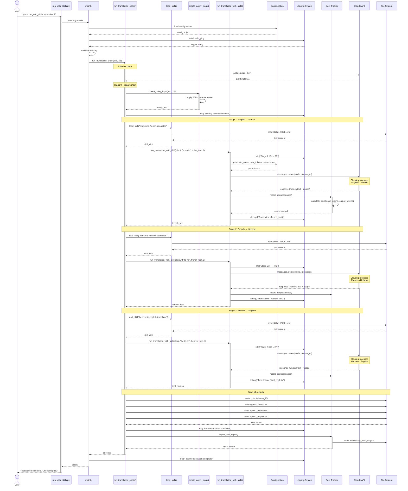
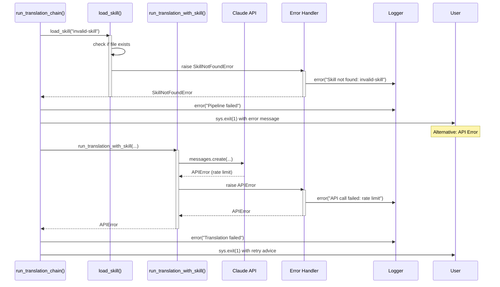
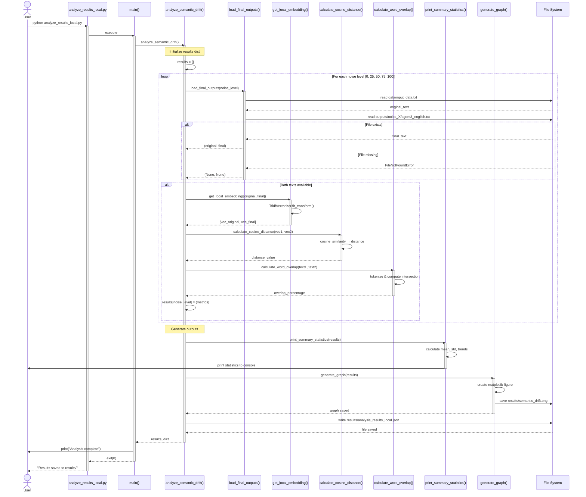
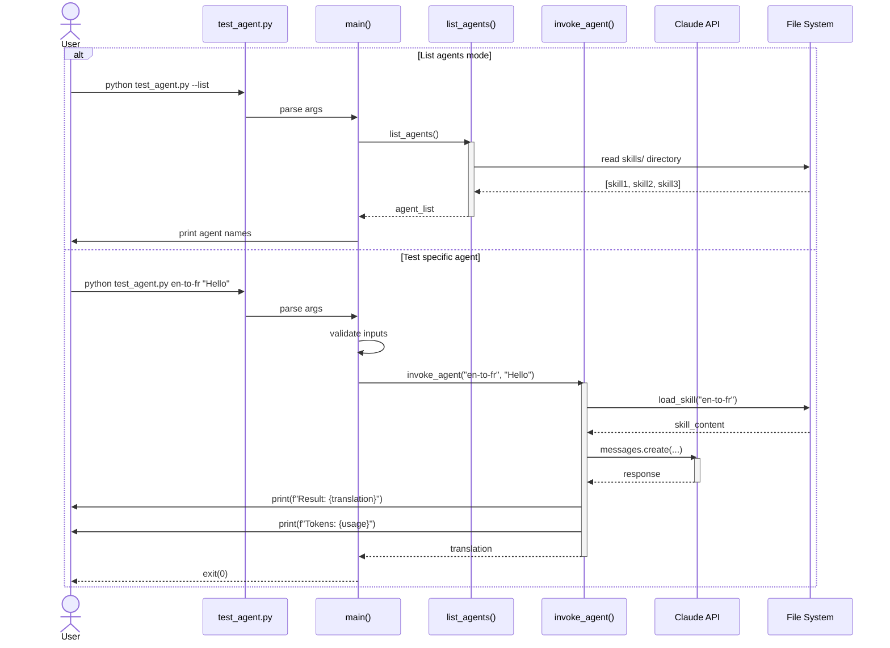
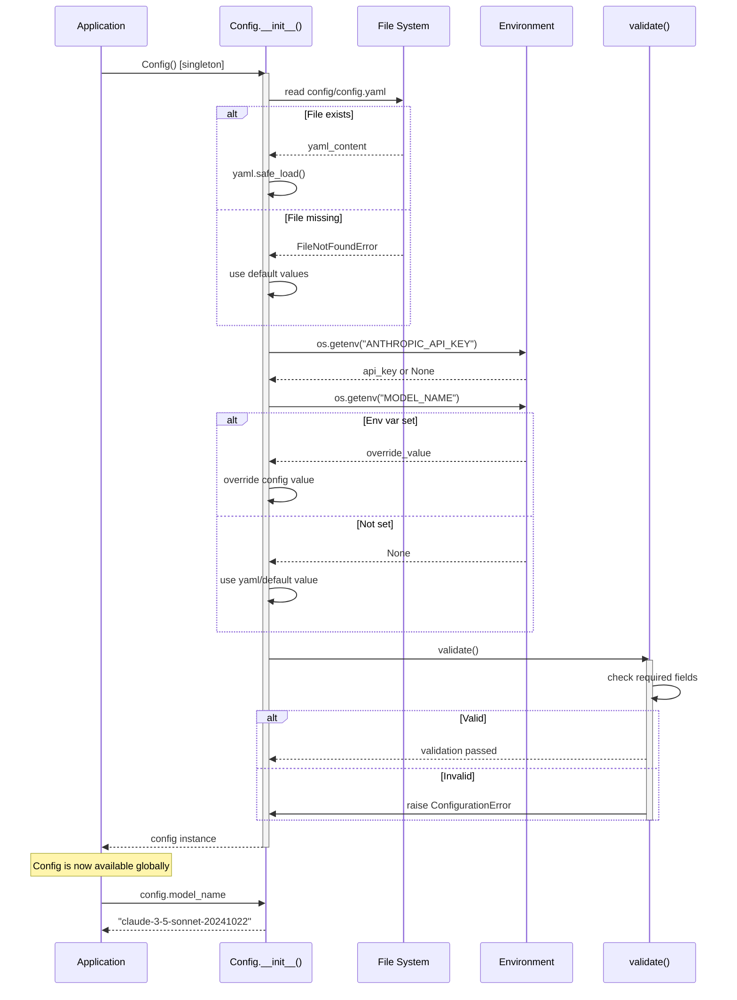
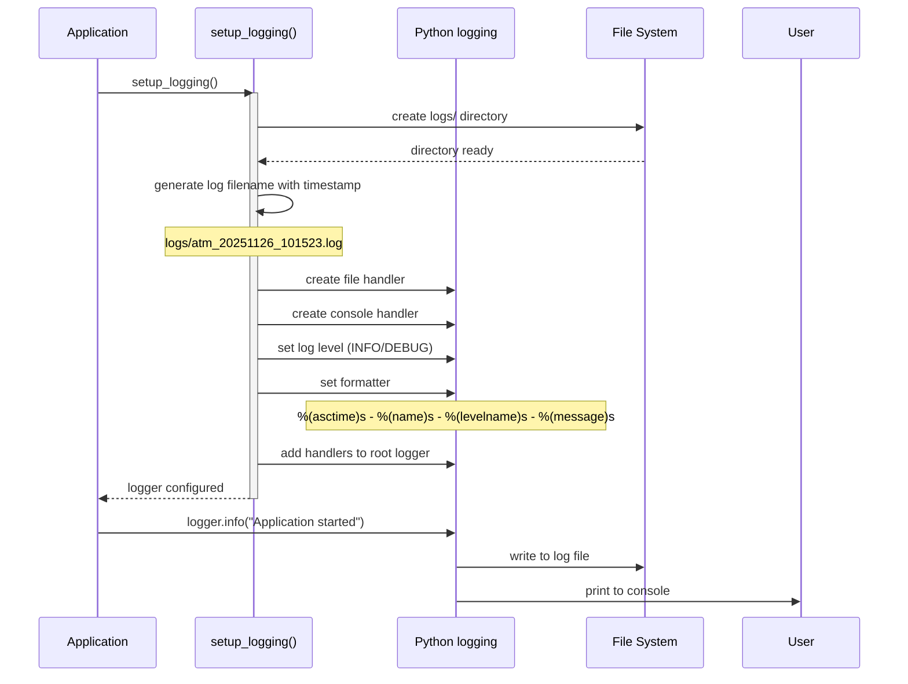
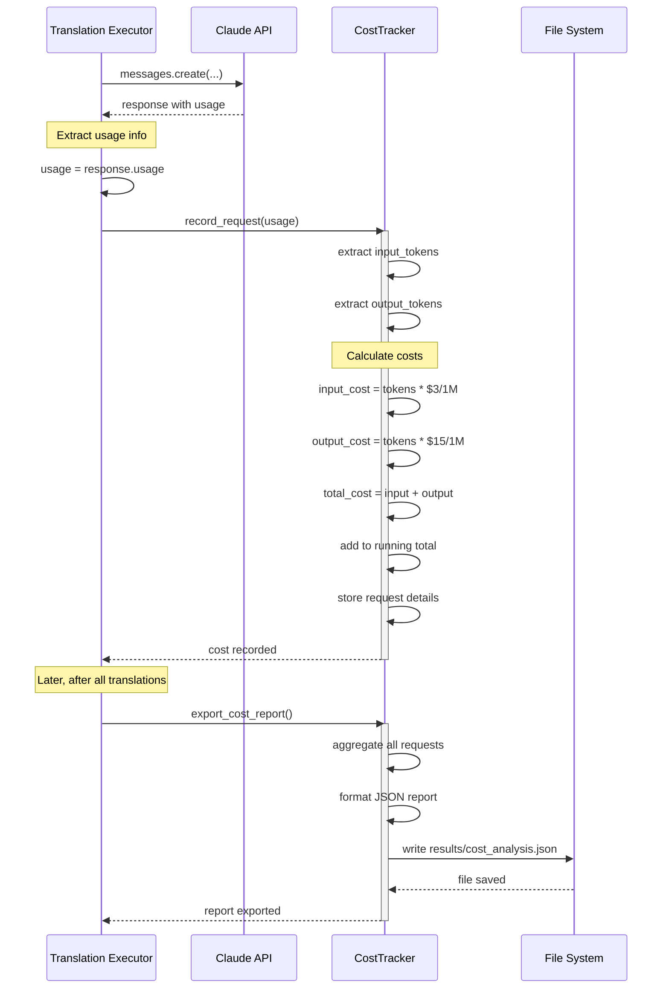
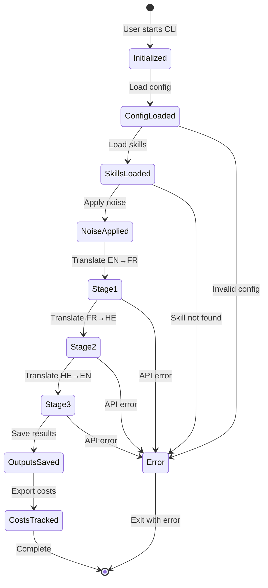

# UML Sequence Diagram
## Agentic Turing Machine - Translation Flow

**Purpose:** Show the detailed sequence of interactions during a complete translation chain execution  
**Scope:** From user command to final output storage

---

## Complete Translation Chain Sequence

---

## Error Handling Sequence

---

## Analysis Flow Sequence

---

## Agent Testing Sequence

---

## Configuration Loading Sequence

---

## Logging Initialization Sequence

---

## Cost Tracking Sequence

---

## Key Timing Information

| Operation | Typical Duration | Bottleneck |
|-----------|------------------|------------|
| Load skill | 1-5 ms | File I/O |
| Create noisy input | 1-10 ms | String operations |
| API call (translation) | 2-10 seconds | Network + AI processing |
| Cost tracking | <1 ms | In-memory calculation |
| Save output file | 1-5 ms | File I/O |
| Generate embeddings | 10-50 ms | TF-IDF vectorization |
| Calculate cosine distance | <1 ms | NumPy operations |
| Generate graph | 100-500 ms | Matplotlib rendering |
| **Full pipeline (1 noise level)** | **~10-30 seconds** | **3x API calls** |
| **Full experiment (5 noise levels)** | **~50-150 seconds** | **15x API calls** |

---

## State Transitions

---

**Document Version:** 1.0  
**Last Updated:** 2025-11-26  
**Status:** Current

---

*These sequence diagrams detail the dynamic behavior of the Agentic Turing Machine system. For static structure, see C4 Component diagrams.*
